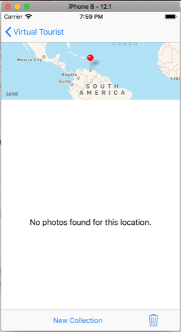

# Virtual Tourist

Virtual Tourist is the fourth project from the **Udacity's iOS Developer Nanodegree course** `(nd003)`.

This app allows users specify travel locations around the world, and create virtual photo albums for each location. The locations and photo albums will be stored in [Core Data](https://developer.apple.com/documentation/coredata) and photos come from [Flickr](https://www.flickr.com/services/api/).

## Implementation

The app will have two view controller scenes.

- **TravelLocationsViewController** Travel Locations Map View: Allows the user to drop pins around the world.
- **PhotoAlbumViewController** Photo Album View: Allows the users to download and edit an album for a location.
- **`Virtual_Tourist.xcdatamodeld`** Database: CoreData Model, using sqlite to persist data and external storage to save photos.

## Example of user flow

App opens and show the world map, users will be able to zoom and scroll around the map using standard pinch and drag gestures.

User tapping and holding the map drops a new pin. Users can place any number of pins on the map.

User taps a pin that does not yet have a photo album, the app will download Flickr images associated with the latitude and longitude of the pin.

- **Note** using the Network Link Conditioner to simulate slow network and the UI Controls.

See more of NLC [here](https://nshipster.com/network-link-conditioner/).

If the Flickr API results no photos for this Geo query, this is informed to user.

If there is a network problem, this is informed to user.

If there is results from the Flickr API, apps start to download photos and persists on the device.

With album fully loaded, user can tap the `New Collection` button to fetch other pictures to this album.

In the App example of [udacity](https://itunes.apple.com/us/app/virtual-tourist-portfolio/id994696845?mt=8), if the user selects an image, the `New Collection` button is changed by a `Remove items` button, I decided to use a trash button as I find it more intuitive.

If the user touches the `🗑` button without selecting any image, an alert will appear to select the photos to be removed.

User touches the photos he wants to remove and the items are highlighted from the rest with a blue border and an alpha effect. A user confirmation is made , then the pictures are removed, and the other photos are rearranged in the collection.
Changes are persisted to the database automatically.

Back to Travel Map View, if user taps the `Edit` button, this View Controller enter in `Editing Mode`, and then a Red Label appears informing the user that tapping on red `Pins` remove the `Pin` from Map and delete all associated data and pictures for this item.
Changes are persisted to the database automatically.

## Requirements

- A valid and active Flickr Account and a Flickr App to use a token to search requests.
- Xcode 9.2 and Swift 4

### Background Services

- Flickr API: to search photos using Geo queries. Docs [here](https://www.flickr.com/services/api/flickr.photos.search.html)

## How to Contribute

Find any typos? Have another resource you think should be included? Contributions are welcome!

First, fork this repository. I'll be happy to know if this example is useful for you.

Next, clone this repository to your desktop to make changes.

Once you've pushed changes to your local repository, you can create a pull request with your suggestion.

It's good take a look at the [Contributing Guide](CONTRIBUTING.MD)

## License

The contents of this repository are covered under the [MIT License](LICENSE.txt).

## Other Resources

Assets : The asset icon was provided from Udacity Team.

The app store icons generated with this great tool: [Makeappicon](https://makeappicon.com/)

<small><i><a href='http://ecotrust-canada.github.io/markdown-toc/'>Table of contents generated with markdown-toc</a></i></small>
